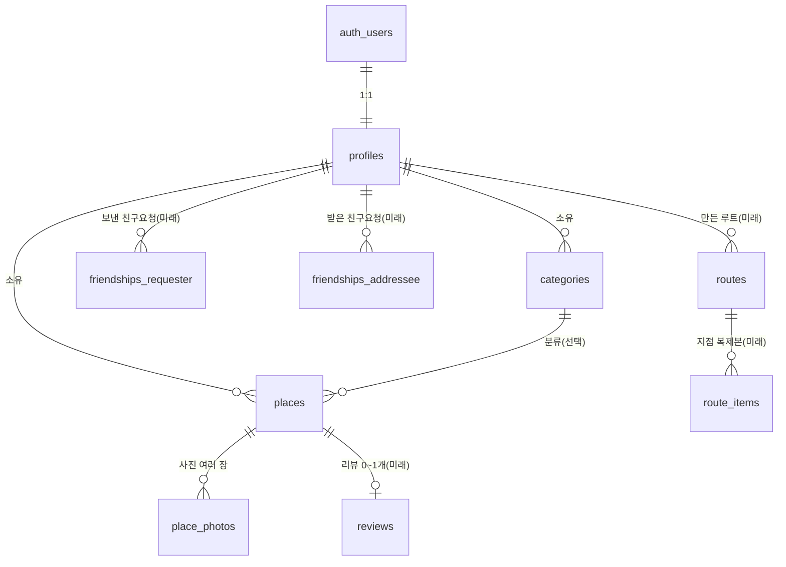

# 데이터 구조 설계 (Schema Plan)

> 이 문서는 **설계 문서**입니다. 여기 적힌 SQL은 **참고용 텍스트**일 뿐이며, 이 문서 작업 단계에서는 **절대 실행하지 않습니다.**
> 실제 테이블 생성/변경은 이후 별도 단계(특히 로그인·RLS 단계 C1)에서 사용자 승인을 받아 진행합니다.

---

## 1. 개요

### 목적
앞으로 추가할 기능(카테고리, 가본/가볼 상태, 사진 여러 장, 친구, 루트 공유, 리뷰, 리포트)이 사용할 데이터 구조를 미리 설계합니다. 빈 테이블을 미리 만들지 않고, "필요할 때 만들 SQL"을 글과 참고 텍스트로만 정리합니다.

### 범위 구분

- **지금 확정 (4개 테이블)** — 실행 가능한 수준으로 정밀하게 설계
  1. `profiles` — 사용자 정보
  2. `categories` — 사용자가 만드는 커스텀 분류
  3. `places` — 앱의 핵심(기존 테이블 확장)
  4. `place_photos` — 한 장소에 사진 여러 장(기존 빈 테이블 활용)

- **미래 잠정 (컬럼 미확정, 위치/연결만 글로 서술)**
  - `friendships` — 친구 관계
  - `routes` + `route_items` — 공유용 루트(좌표 복제 보관)
  - `reviews` — 비공개 리뷰(장소당 0~1개)
  - 리포트 / PDF 회고 — 별도 테이블 없이 `places` 집계로 파생

### 현재 DB에 실재하는 것 (사실)
- `places`: `id(uuid)`, `name(text)`, `latitude(float8)`, `longitude(float8)`, `visited_on(date)`, 메모 컬럼 1개(`memo`)
- `place_photos`: 빈 상태로 존재
- 기존 `places`/`place_photos`에 쌓인 데이터는 **전부 테스트용 → 폐기 가능**. 따라서 `user_id`를 `NOT NULL`로 바로 추가해도 됨.

---

## 2. 지금 단계 테이블 (확정 4개)

### 2-1. `profiles` — auth.users 위에 얹는 사용자 정보

목적: 로그인 사용자(Supabase `auth.users`)에 닉네임 등 앱용 정보를 1:1로 붙인다.

| 컬럼 | 타입 | NULL | 기본값 | 역할 |
|------|------|------|--------|------|
| `id` | uuid | NOT NULL | (없음) | PK. `auth.users.id`와 동일한 값(1:1) |
| `nickname` | text | NULL 허용 | (없음) | 표시 이름 |
| `avatar_url` | text | NULL 허용 | (없음) | 프로필 사진 경로. 친구 기능용으로 자리만 미리 마련 |
| `created_at` | timestamptz | NOT NULL | `now()` | 생성 시각 |

- FK: `id` → `auth.users(id)` (1:1, `ON DELETE CASCADE` — 계정 삭제 시 프로필도 함께 삭제).
- 인덱스: `id`가 PK라 별도 인덱스 불필요.

참고용 (실행 금지):
```sql
-- 참고용. 실행하지 말 것.
create table profiles (
  id uuid primary key references auth.users (id) on delete cascade,
  nickname text,
  avatar_url text,
  created_at timestamptz not null default now()
);
```

---

### 2-2. `categories` — 사용자가 만드는 커스텀 분류

목적: 사용자가 직접 만든 분류(예: 카페, 데이트, 맛집)와 핀 색상을 보관한다.

| 컬럼 | 타입 | NULL | 기본값 | 역할 |
|------|------|------|--------|------|
| `id` | uuid | NOT NULL | `gen_random_uuid()` | PK |
| `user_id` | uuid | NOT NULL | (없음) | 소유자. FK → `profiles.id` |
| `name` | text | NOT NULL | (없음) | 분류 이름 |
| `color` | text | NOT NULL | (없음) | 핀 색상(사용자가 선택) |
| `created_at` | timestamptz | NOT NULL | `now()` | 생성 시각 |

- FK: `user_id` → `profiles(id)` (`ON DELETE CASCADE` — 프로필 삭제 시 그 사람의 카테고리도 삭제).
- 인덱스(확정): `categories(user_id)` (내 카테고리 목록 조회용).

참고용 (실행 금지):
```sql
-- 참고용. 실행하지 말 것.
create table categories (
  id uuid primary key default gen_random_uuid(),
  user_id uuid not null references profiles (id) on delete cascade,
  name text not null,
  color text not null, -- hex 문자열 (예: '#1d4ed8')
  created_at timestamptz not null default now()
);
create index categories_user_id_idx on categories (user_id);
```

---

### 2-3. `places` — 앱의 핵심 (기존 테이블 확장)

목적: 다녀온/가볼 장소(핀). 기존 컬럼은 유지하고, 분류·상태·출처·소유자를 추가한다.

| 컬럼 | 타입 | NULL | 기본값 | 역할 |
|------|------|------|--------|------|
| `id` | uuid | NOT NULL | (기존) | PK (기존 유지) |
| `name` | text | NOT NULL | (기존) | 장소 이름 (기존 유지) |
| `latitude` | float8 | NOT NULL | (기존) | 위도 (기존 유지) |
| `longitude` | float8 | NOT NULL | (기존) | 경도 (기존 유지) |
| `memo` | text | NULL 허용 | (기존) | 한 줄 메모 (기존 유지) |
| `visited_on` | date | **NULL 허용으로 변경** | (없음) | 방문 날짜. `want`/`imported`(아직 안 감)면 NULL |
| `user_id` | uuid | NOT NULL (신규) | (없음) | 소유자. FK → `profiles.id` |
| `category_id` | uuid | NULL 허용 (신규) | (없음) | 분류. FK → `categories.id`. 분류 없는 장소 허용 |
| `status` | text | NOT NULL (신규) | **기본값 없음** | `'visited'` / `'want'` / `'imported'` (CHECK 제약, INSERT마다 반드시 명시) |
| `source` | text | NULL 허용 (신규) | (없음) | 가져온 루트의 출처 |

- 상태 의미(UI 표시): `visited`=가본 곳, `want`=가볼 곳, `imported`=가져온 루트.
- **핵심 규칙**: `status`와 `source`는 서로 독립이다. `imported` 장소를 체크인하면 `status`만 `visited`로 바뀌고 `source`는 그대로 유지한다(출처 기록 보존).
- **데이터 일관성 규칙**: `status='visited'`이면 `visited_on`이 **반드시 있어야** 하고, `status='want'` 또는 `'imported'`(아직 안 감)이면 `visited_on`은 **NULL**이다.
- FK: `user_id` → `profiles(id)` (`ON DELETE CASCADE`), `category_id` → `categories(id)` (`ON DELETE SET NULL`).
- 인덱스(확정): `places(user_id, visited_on)` **복합** / `places(category_id)`. ※ `places(user_id)` 단독은 위 복합 인덱스가 커버하므로 만들지 않는다.

참고용 (실행 금지) — 기존 테이블이므로 ALTER 형태로 표기:
```sql
-- 참고용. 실행하지 말 것. (기존 places 확장)
alter table places add column user_id uuid not null references profiles (id) on delete cascade;
alter table places add column category_id uuid references categories (id) on delete set null;
alter table places add column status text not null check (status in ('visited', 'want', 'imported'));
alter table places add column source text;
alter table places alter column visited_on drop not null; -- want/imported는 NULL 허용

-- 인덱스(확정)
create index places_user_id_visited_on_idx on places (user_id, visited_on); -- 복합. places(user_id) 단독은 만들지 않음
create index places_category_id_idx on places (category_id);
```

---

### 2-4. `place_photos` — 한 장소에 사진 여러 장 (기존 빈 테이블 활용)

목적: 한 장소(`places`)에 사진을 여러 장 연결한다. 사진 파일 자체가 아니라 Supabase Storage 안의 경로만 저장한다.

| 컬럼 | 타입 | NULL | 기본값 | 역할 |
|------|------|------|--------|------|
| `id` | uuid | NOT NULL | `gen_random_uuid()` | PK |
| `place_id` | uuid | NOT NULL | (없음) | 어느 장소의 사진인지. FK → `places.id` |
| `storage_path` | text | NOT NULL | (없음) | Storage 경로(파일 위치만) |
| `created_at` | timestamptz | NOT NULL | `now()` | 생성 시각 |

- FK: `place_id` → `places(id)` (`ON DELETE CASCADE` — 장소 삭제 시 사진 행도 함께 삭제).
- 인덱스(확정): `place_photos(place_id)` (한 장소의 사진 모아보기).

참고용 (실행 금지):
```sql
-- 참고용. 실행하지 말 것.
create table place_photos (
  id uuid primary key default gen_random_uuid(),
  place_id uuid not null references places (id) on delete cascade,
  storage_path text not null,
  created_at timestamptz not null default now()
);
create index place_photos_place_id_idx on place_photos (place_id);
```

> 참고: `place_photos`는 이미 빈 테이블로 존재합니다. 실제로는 위 정의에 맞게 컬럼을 정리하는 작업이 필요할 수 있으며, 정확한 방식은 실행 단계에서 현재 컬럼을 확인한 뒤 결정합니다.

---

## 3. 미래 단계 연결 (컬럼 미확정, 위치/연결만 서술)

### friendships — 친구 관계
- `profiles` ↔ `profiles` 양방향 관계. 한 행이 두 개의 FK(`requester_id`, `addressee_id`)로 **둘 다 `profiles`를 가리킨다.**
- `status`로 대기/수락 구분.
- 친구로 수락된 사이에서만 서로의 루트를 열람할 수 있게 하는 기준 테이블이 된다(열람 권한은 C1의 RLS와 함께 설계).

### routes + route_items — 공유용 루트
- 공유 루트는 **원작자의 `places`를 직접 가리키지 않는다.** 대신 자기 좌표를 따로 **복제해서** 들고 있는다.
  - 이유: 원작자가 나중에 장소를 지워도 공유된 루트가 깨지지 않게 하기 위함.
- `routes`: 루트 한 개(제목, 만든 사람 등). `route_items`: 그 루트에 담긴 지점들(이름·좌표 복제본).
- **가져오기**: 받은 사람이 루트를 가져오면, `route_items`가 **가져온 사람의 `places`로 복사**된다. 이때 복사된 places는 `status='imported'`, `source`에 출처를 기록한다.

### reviews — 비공개 리뷰
- 한 `places`당 0~1개. (장소 하나에 리뷰 최대 한 개)
- 비공개 별점 + 내용. **공개 별점 시스템이 아니다.**
- 위치: `reviews.place_id` → `places.id` 형태로 붙는다.

### 리포트 / PDF 회고 — 테이블 없음(파생 결과물)
- 별도 테이블을 두지 않는다. `places`를 기간으로 집계하고 AI로 요약하는 **파생 결과물**이다.
- 추후 "만든 PDF 목록"을 저장할 필요가 생기면, 그때 테이블 1개만 추가한다(지금은 만들지 않음).



---

## 4. 마이그레이션 · 보안 위험

### 마이그레이션 위험
- `places.user_id`를 `NOT NULL`로 추가합니다. 기존 행에는 `user_id` 값이 없어 보통은 실패하지만, **기존 데이터는 전부 테스트용이라 폐기 전제**이므로 문제 없습니다.
  - 실행 단계에서: 기존 `places`/`place_photos` 데이터를 비운 뒤(또는 테이블 재정의), `user_id NOT NULL`을 추가합니다.
- `visited_on`을 `NOT NULL` → `NULL 허용`으로 완화합니다(가볼 곳/가져온 곳은 날짜 없음).
- `status`는 `NOT NULL`이며 **기본값을 두지 않습니다.** 따라서 모든 INSERT가 `status`를 반드시 명시해야 합니다(앱 코드에서 항상 값 지정).

### 삭제 연동(CASCADE 체인)
- 삭제는 다음 순서로 연쇄됩니다: **`auth.users` 삭제 → `profiles` 삭제 → 그 사람의 `places`·`categories` 삭제 → `place_photos` 삭제** (모두 `ON DELETE CASCADE`).
- 단, `places.category_id`는 이 체인과 별개로 `ON DELETE SET NULL`입니다(카테고리만 지우면 장소는 남고 분류만 해제).
- **중요(Storage 주의)**: 이 CASCADE는 **DB의 행만** 지웁니다. **Supabase Storage에 올라간 실제 사진 파일은 자동으로 지워지지 않습니다.** Storage 파일 정리 방법은 **C1(로그인) 단계에서 결정**합니다.

### 보안 위험 (중요)
- 지금 앱은 로그인이 없고, Supabase anon 키로 누구나 읽고 쓰는 상태입니다.
- `user_id`가 생기면 **C1(로그인 + RLS) 단계에서 RLS(행 수준 보안)로 "본인 데이터만 보이고 쓸 수 있게" 반드시 격리**해야 합니다. 그 전까지는 멀티 사용자 분리가 되지 않습니다.
- 친구/루트 공유의 "친구만 열람" 같은 권한도 RLS로 함께 설계합니다.

---

## 5. 결정 (확정됨)

아래 항목은 사용자 확인을 거쳐 **확정**되었습니다.

- **D1. `places.status` 저장 방식** → **text + CHECK 제약**. 허용값은 `'visited'`, `'want'`, `'imported'` 세 개.
- **D2. `categories.color` 형식** → **hex 문자열**(예: `'#1d4ed8'`), `NOT NULL`.
- **D3. 카테고리 삭제 시 `places.category_id`** → **`ON DELETE SET NULL`** (분류만 해제, 장소는 유지).
- **D4. 인덱스** → **`places(user_id, visited_on)` 복합** / **`places(category_id)`** / **`categories(user_id)`** / **`place_photos(place_id)`**. ※ `places(user_id)` 단독은 복합 인덱스가 커버하므로 만들지 않는다.
- **D5. 삭제 연동(CASCADE 체인)** → **`auth.users` → `profiles` → `places`·`categories` → `place_photos`** 까지 전부 `ON DELETE CASCADE`. 단, DB 행만 지우고 **Supabase Storage 실제 사진 파일은 지우지 않음**(정리 방법은 C1에서 결정 — 4장 참고). `places.category_id`는 체인과 별개로 `ON DELETE SET NULL`.
- **D6. `places.status` 기본값** → **두지 않음**. `NOT NULL`이되 기본값 없음(각 INSERT가 반드시 명시). 일관성 규칙: `visited`면 `visited_on` 있음, `want`/`imported`면 `visited_on`은 NULL.
- **D7. 사진 정렬 순서 컬럼(`position`)** → **지금 두지 않음**. `created_at` 순으로 표시.
