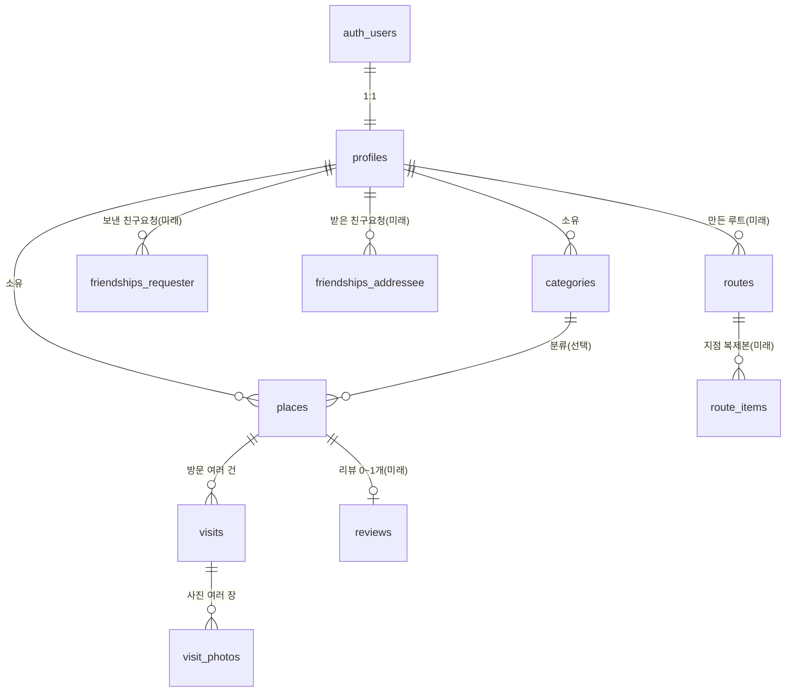

# 데이터 구조 설계 (Schema Plan)

> **이 문서는 현재 실제 DB 구조를 반영합니다. 최종 갱신: 2026-06-15.**
> 확정 테이블(profiles, categories, places, visits, visit_photos)은 실제 DB에 적용 완료된 상태입니다(C1 로그인·RLS + 장소/방문 분리까지).
> 미래 테이블(friendships, routes, reviews 등)은 아직 설계만 한 상태입니다.
> 아래 SQL 블록은 **구조 설명용 참고 텍스트**입니다. 그대로 재실행하지 말고, 변경이 필요하면 새 마이그레이션으로 진행하세요.

---

## 1. 개요

### 목적
앞으로 추가할 기능(카테고리, 가본/가볼 상태, 사진 여러 장, 친구, 루트 공유, 리뷰, 리포트)이 사용할 데이터 구조를 미리 설계합니다. 빈 테이블을 미리 만들지 않고, "필요할 때 만들 SQL"을 글과 참고 텍스트로만 정리합니다.

### 범위 구분

- **적용 완료 (5개 테이블)** — 실제 DB에 반영됨
  1. `profiles` — 사용자 정보
  2. `categories` — 사용자가 만드는 커스텀 분류
  3. `places` — 장소 "정체성"(방문 정보는 없음)
  4. `visits` — 한 장소의 방문 1건씩(한 장소에 여러 개)
  5. `visit_photos` — 방문에 속한 사진(구 place_photos 폐기)

- **미래 잠정 (컬럼 미확정, 위치/연결만 글로 서술)**
  - `friendships` — 친구 관계
  - `routes` + `route_items` — 공유용 루트(좌표 복제 보관)
  - `reviews` — 비공개 리뷰(장소당 0~1개)
  - 리포트 / PDF 회고 — 별도 테이블 없이 `places` 집계로 파생

### 현재 DB에 실재하는 것 (사실, 2026-06-15 기준)
- `profiles`: `id`, `nickname`, `avatar_url`, `created_at`. 가입 시 트리거로 자동 생성.
- `categories`: `id`, `user_id`, `name`, `color`, `created_at`.
- `places` (정체성만): `id`, `user_id`, `category_id`, `name`, `latitude`, `longitude`, `status`, `plan_date`, `plan_with`, `source`, `visibility`, `address`, `kakao_place_id`, `created_at`. **`visited_on`/`memo`는 없음.**
- `visits`: `id`, `place_id`, `visited_on`, `memo`, `created_at`. 한 장소에 여러 방문.
- `visit_photos`: `id`, `visit_id`, `storage_path`, `created_at`. Storage 경로 `{visit_id}/파일명`.
- 모든 테이블 RLS 켜짐(본인 데이터만). `visits`는 부모 place가 본인 것일 때, `visit_photos`는 그 방문의 place가 본인 것일 때.

---

## 2. 지금 단계 테이블 (확정 4개)

### 2-1. `profiles` — auth.users 위에 얹는 사용자 정보

목적: 로그인 사용자(Supabase `auth.users`)에 닉네임 등 앱용 정보를 1:1로 붙인다.

| 컬럼 | 타입 | NULL | 기본값 | 역할 |
|------|------|------|--------|------|
| `id` | uuid | NOT NULL | (없음) | PK. `auth.users.id`와 동일한 값(1:1) |
| `nickname` | text | NULL 허용 | (없음) | 표시 이름 |
| `avatar_url` | text | NULL 허용 | (없음) | 프로필 사진 경로. 친구 기능용으로 자리만 미리 마련 |
| `created_at` | timestamptz | NOT NULL | `now()` | 생성 시각 |

- FK: `id` → `auth.users(id)` (1:1, `ON DELETE CASCADE` — 계정 삭제 시 프로필도 함께 삭제).
- 인덱스: `id`가 PK라 별도 인덱스 불필요.

참고용 (실행 금지):
```sql
-- 참고용. 실행하지 말 것.
create table profiles (
  id uuid primary key references auth.users (id) on delete cascade,
  nickname text,
  avatar_url text,
  created_at timestamptz not null default now()
);
```

---

### 2-2. `categories` — 사용자가 만드는 커스텀 분류

목적: 사용자가 직접 만든 분류(예: 카페, 데이트, 맛집)와 핀 색상을 보관한다.

| 컬럼 | 타입 | NULL | 기본값 | 역할 |
|------|------|------|--------|------|
| `id` | uuid | NOT NULL | `gen_random_uuid()` | PK |
| `user_id` | uuid | NOT NULL | (없음) | 소유자. FK → `profiles.id` |
| `name` | text | NOT NULL | (없음) | 분류 이름 |
| `color` | text | NOT NULL | (없음) | 핀 색상(사용자가 선택) |
| `created_at` | timestamptz | NOT NULL | `now()` | 생성 시각 |

- FK: `user_id` → `profiles(id)` (`ON DELETE CASCADE` — 프로필 삭제 시 그 사람의 카테고리도 삭제).
- 인덱스(확정): `categories(user_id)` (내 카테고리 목록 조회용).

참고용 (실행 금지):
```sql
-- 참고용. 실행하지 말 것.
create table categories (
  id uuid primary key default gen_random_uuid(),
  user_id uuid not null references profiles (id) on delete cascade,
  name text not null,
  color text not null, -- hex 문자열 (예: '#1d4ed8')
  created_at timestamptz not null default now()
);
create index categories_user_id_idx on categories (user_id);
```

---

### 2-3. `places` — 장소 "정체성"

목적: 지도에 찍히는 장소(핀) 하나의 정체성. **방문일·메모·사진은 여기 없다** — 그건 `visits`/`visit_photos`에 있다. 한 장소에 방문이 0개 이상 매달린다.

| 컬럼 | 타입 | NULL | 기본값 | 역할 |
|------|------|------|--------|------|
| `id` | uuid | NOT NULL | `gen_random_uuid()` | PK |
| `user_id` | uuid | NOT NULL | (없음) | 소유자. FK → `profiles.id` |
| `category_id` | uuid | NULL 허용 | (없음) | 분류. FK → `categories.id`. 분류 없는 장소 허용 |
| `name` | text | NOT NULL | (없음) | 장소 이름 |
| `latitude` | float8 | NOT NULL | (없음) | 위도 |
| `longitude` | float8 | NOT NULL | (없음) | 경도 |
| `status` | text | NOT NULL | **기본값 없음** | `'visited'` / `'want'` / `'imported'` (CHECK 제약, INSERT마다 반드시 명시) |
| `plan_date` | date | NULL 허용 | (없음) | `want`의 계획일. 가볼 루트 연결 기준. 미정이면 NULL |
| `plan_with` | text | NULL 허용 | (없음) | 누구랑 갈지(선택) |
| `source` | text | NULL 허용 | (없음) | 가져온 루트의 출처 |
| `visibility` | text | NOT NULL | `'private'` | `'private'` / `'friends'` / `'public'`. 신규 저장은 기본 `private` |
| `address` | text | NULL 허용 | (없음) | 카카오에서 받은 주소 |
| `kakao_place_id` | text | NULL 허용 | (없음) | 카카오 장소 고유 ID. 중복 저장 방지·재방문 연결 기준 |
| `created_at` | timestamptz | NOT NULL | `now()` | 생성 시각 |

- 상태 의미(UI 표시): `visited`=가본 곳, `want`=가볼 곳, `imported`=가져온 루트.
- **status와 visits 관계**: `status='visited'`면 `visits`가 1개 이상, `'want'`/`'imported'`면 0개(`plan_date`만). 첫 방문이 생기면 체크인으로 `visited` 전환.
- **status와 source는 독립**: `imported`를 체크인해도 `status`만 `visited`로 바뀌고 `source`는 보존.
- **같은 장소 판단은 `kakao_place_id`로**: 이미 같은 `kakao_place_id`가 있으면 새 place를 만들지 말고 그 place에 방문만 추가(재방문). 이름·좌표 근접으로 판단하지 않는다.
- FK: `user_id` → `profiles(id)` (`ON DELETE CASCADE`), `category_id` → `categories(id)` (`ON DELETE SET NULL`).
- 인덱스: `places(user_id)` / `places(category_id)`.

참고용 (구조 설명):
```sql
-- 참고용. 그대로 재실행하지 말 것.
create table places (
  id uuid primary key default gen_random_uuid(),
  user_id uuid not null references profiles (id) on delete cascade,
  category_id uuid references categories (id) on delete set null,
  name text not null,
  latitude float8 not null,
  longitude float8 not null,
  status text not null check (status in ('visited', 'want', 'imported')),
  plan_date date,
  plan_with text,
  source text,
  visibility text not null default 'private' check (visibility in ('private', 'friends', 'public')),
  address text,
  kakao_place_id text,
  created_at timestamptz not null default now()
);
create index places_user_id_idx on places (user_id);
create index places_category_id_idx on places (category_id);
```

---

### 2-4. `visits` — 한 장소의 방문 1건씩

목적: 한 장소(`places`)에 대한 방문을 1건씩 기록한다. 같은 장소를 여러 번 가면 visit이 여러 개 생긴다. **방문일·메모는 여기 있다.**

| 컬럼 | 타입 | NULL | 기본값 | 역할 |
|------|------|------|--------|------|
| `id` | uuid | NOT NULL | `gen_random_uuid()` | PK |
| `place_id` | uuid | NOT NULL | (없음) | 어느 장소의 방문인지. FK → `places.id` |
| `visited_on` | date | NOT NULL | (없음) | 방문 날짜 |
| `memo` | text | NULL 허용 | (없음) | 그 방문의 한 줄 메모 |
| `created_at` | timestamptz | NOT NULL | `now()` | 생성 시각 (같은 날 동선 정렬에 사용) |

- FK: `place_id` → `places(id)` (`ON DELETE CASCADE` — 장소 삭제 시 그 방문들도 함께 삭제).
- 가본 동선은 `visits.visited_on` 기준이다(visit 단위). 같은 장소를 다른 날 가면 각 날짜 루트에 각각 들어간다.
- 인덱스: `visits(place_id)`, `visits(visited_on)`.

참고용 (구조 설명):
```sql
-- 참고용. 그대로 재실행하지 말 것.
create table visits (
  id uuid primary key default gen_random_uuid(),
  place_id uuid not null references places (id) on delete cascade,
  visited_on date not null,
  memo text,
  created_at timestamptz not null default now()
);
create index visits_place_id_idx on visits (place_id);
create index visits_visited_on_idx on visits (visited_on);
```

---

### 2-5. `visit_photos` — 방문에 속한 사진 (구 `place_photos` 폐기)

목적: 한 방문(`visits`)에 사진을 여러 장 연결한다. 사진 파일 자체가 아니라 Supabase Storage 안의 경로만 저장한다. Storage 경로는 `{visit_id}/파일명` 형태다(RLS·Storage 정책이 이 경로를 기대).

| 컬럼 | 타입 | NULL | 기본값 | 역할 |
|------|------|------|--------|------|
| `id` | uuid | NOT NULL | `gen_random_uuid()` | PK |
| `visit_id` | uuid | NOT NULL | (없음) | 어느 방문의 사진인지. FK → `visits.id` |
| `storage_path` | text | NOT NULL | (없음) | Storage 경로(`{visit_id}/파일명`) |
| `created_at` | timestamptz | NOT NULL | `now()` | 생성 시각 |

- FK: `visit_id` → `visits(id)` (`ON DELETE CASCADE` — 방문 삭제 시 사진 행도 함께 삭제).
- 인덱스: `visit_photos(visit_id)` (한 방문의 사진 모아보기).

참고용 (구조 설명):
```sql
-- 참고용. 그대로 재실행하지 말 것.
create table visit_photos (
  id uuid primary key default gen_random_uuid(),
  visit_id uuid not null references visits (id) on delete cascade,
  storage_path text not null,
  created_at timestamptz not null default now()
);
create index visit_photos_visit_id_idx on visit_photos (visit_id);
```

---

## 3. 미래 단계 연결 (컬럼 미확정, 위치/연결만 서술)

### friendships — 친구 관계
- `profiles` ↔ `profiles` 양방향 관계. 한 행이 두 개의 FK(`requester_id`, `addressee_id`)로 **둘 다 `profiles`를 가리킨다.**
- `status`로 대기/수락 구분.
- 친구로 수락된 사이에서만 서로의 루트를 열람할 수 있게 하는 기준 테이블이 된다(열람 권한은 C1의 RLS와 함께 설계).

### routes + route_items — 공유용 루트
- 공유 루트는 **원작자의 `places`를 직접 가리키지 않는다.** 대신 자기 좌표를 따로 **복제해서** 들고 있는다.
  - 이유: 원작자가 나중에 장소를 지워도 공유된 루트가 깨지지 않게 하기 위함.
- `routes`: 루트 한 개(제목, 만든 사람 등). `route_items`: 그 루트에 담긴 지점들(이름·좌표 복제본).
- **가져오기**: 받은 사람이 루트를 가져오면, `route_items`가 **가져온 사람의 `places`로 복사**된다. 이때 복사된 places는 `status='imported'`, `source`에 출처를 기록한다.

### reviews — 비공개 리뷰
- 한 `places`당 0~1개. (장소 하나에 리뷰 최대 한 개)
- 비공개 별점 + 내용. **공개 별점 시스템이 아니다.**
- 위치: `reviews.place_id` → `places.id` 형태로 붙는다.

### 리포트 / PDF 회고 — 테이블 없음(파생 결과물)
- 별도 테이블을 두지 않는다. `places`를 기간으로 집계하고 AI로 요약하는 **파생 결과물**이다.
- 추후 "만든 PDF 목록"을 저장할 필요가 생기면, 그때 테이블 1개만 추가한다(지금은 만들지 않음).



---

## 4. 마이그레이션 · 보안 위험

### 마이그레이션 이력 (적용 완료)
- `user_id`(NOT NULL, FK→profiles)를 `places`·`categories`에 추가하고, 모든 테이블 RLS로 본인 데이터만 격리(C1).
- 장소/방문 분리: `places`에서 `visited_on`/`memo`를 제거하고 `visits` 테이블로 옮김(한 장소에 여러 방문). 사진은 `place_photos` → `visit_photos`로 이전(Storage 경로 `{visit_id}/`).
- `places.status`는 `NOT NULL`·기본값 없음(모든 INSERT가 명시). `places.visibility`는 기본 `'private'`.

### 삭제 연동(CASCADE 체인)
- 삭제는 다음 순서로 연쇄됩니다: **`auth.users` 삭제 → `profiles` 삭제 → 그 사람의 `places`·`categories` 삭제 → `visits` 삭제 → `visit_photos` 삭제** (모두 `ON DELETE CASCADE`).
- 단, `places.category_id`는 이 체인과 별개로 `ON DELETE SET NULL`입니다(카테고리만 지우면 장소는 남고 분류만 해제).
- 계정을 지울 땐 `profiles` 행이 아니라 **Authentication의 사용자(`auth.users`)를 삭제**해야 위 체인이 돕니다. `profiles`만 지우면 계정이 고아로 남습니다.
- **중요(Storage 주의)**: 이 CASCADE는 **DB의 행만** 지웁니다. **Supabase Storage에 올라간 실제 사진 파일(`{visit_id}/...`)은 자동으로 지워지지 않습니다.** Storage 파일 정리 방법은 **추후 결정**합니다.

### 보안 (적용 상태)
- 로그인(Supabase Auth) + 모든 테이블 RLS로 **본인 데이터만 보이고 쓸 수 있게 격리됨**(C1 완료). `visits`는 부모 place 기준, `visit_photos`는 그 방문의 place 기준으로 RLS가 건다.
- 친구/루트 공유의 "친구만 열람" 권한은 소셜 단계(D)에서 RLS로 함께 설계한다.

---

## 5. 결정 (확정됨)

아래 항목은 사용자 확인을 거쳐 **확정**되었습니다.

- **D1. `places.status` 저장 방식** → **text + CHECK 제약**. 허용값은 `'visited'`, `'want'`, `'imported'` 세 개.
- **D2. `categories.color` 형식** → **hex 문자열**(예: `'#1d4ed8'`), `NOT NULL`.
- **D3. 카테고리 삭제 시 `places.category_id`** → **`ON DELETE SET NULL`** (분류만 해제, 장소는 유지).
- **D4. 인덱스** → **`places(user_id)`** / **`places(category_id)`** / **`categories(user_id)`** / **`visits(place_id)`** / **`visits(visited_on)`** / **`visit_photos(visit_id)`**.
- **D5. 삭제 연동(CASCADE 체인)** → **`auth.users` → `profiles` → `places`·`categories` → `visits` → `visit_photos`** 까지 전부 `ON DELETE CASCADE`. 단, DB 행만 지우고 **Supabase Storage 실제 사진 파일은 지우지 않음**(정리 방법은 추후 결정 — 4장 참고). `places.category_id`는 체인과 별개로 `ON DELETE SET NULL`.
- **D6. `places.status` 기본값** → **두지 않음**. `NOT NULL`이되 기본값 없음(각 INSERT가 반드시 명시). 방문일·메모는 `places`가 아니라 `visits`에 있다(`visited`면 `visits` 1개 이상, `want`/`imported`면 0개).
- **D7. 사진 정렬 순서 컬럼(`position`)** → **지금 두지 않음**. `created_at` 순으로 표시. 사진은 `visit_photos`(방문에 속함)에 저장한다.
- **D8. `places.visibility`** → `'private'`/`'friends'`/`'public'`, **기본 `'private'`**. 신규 저장은 항상 private(공개 설정 UI는 소셜 단계에서).
- **D9. 장소/방문 분리** → `places`는 정체성만, 방문은 `visits`로 분리(한 장소에 여러 방문). 같은 장소 판단은 `kakao_place_id`.
